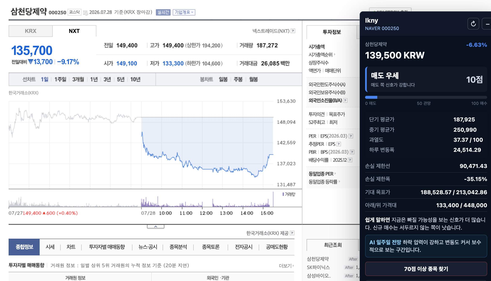
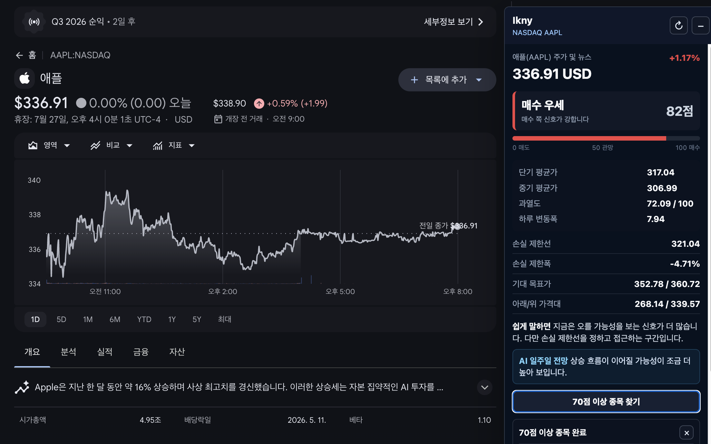

# (Ikny) Stock Screen Overlay

네이버 금융이나 Google Finance에서 보고 있는 주식 화면 위에 자동 분석 패널을 띄우는 Chrome/Edge 확장 프로그램입니다. 종목 코드를 따로 입력하지 않아도 현재 페이지의 종목을 감지하고, 매수/매도 의견을 0~100점으로 보여줍니다.

I Know, Now You Know (Ikny)

* 복잡한 주식 데이터를 분석해, 이제는 사용자도 시장의 흐름을 알 수 있게 해준다는 의미로 지었습니다.

## Demo

### Naver Finance



### Google Finance




## 주요 기능

- 주식 페이지 위에 뜨는 고정 오버레이 패널
- 네이버 금융, 모바일 네이버 증권, Google Finance 종목 페이지 자동 감지
- 매수/매도 의견을 0~100점으로 표시
- 한국 주식 화면 기준 색상 적용: 상승 빨간색, 하락 파란색
- 어려운 지표명을 쉬운 말로 표시: 단기 평균가, 중기 평균가, 과열도, 하루 변동폭
- 손실 제한선, 손실 제한폭, 기대 목표가, 아래/위 가격대 표시
- 현재 흐름을 바탕으로 한 `AI 일주일 전망` 한 줄 요약
- `70점 이상 종목 찾기` 버튼으로 기본 관심 종목 중 매수 점수가 높은 종목 검색
- 30초 자동 갱신
- 패널 드래그 이동, 최소화, 크기 조절 지원

## 사용법

1. Chrome 또는 Edge에서 `chrome://extensions`를 엽니다.
2. 우측 상단 `개발자 모드`를 켭니다.
3. `압축해제된 확장 프로그램을 로드`를 누릅니다.
4. 아래 폴더를 선택합니다.

```text
/Users/song/Desktop/ikny/browser_extension
```

5. 네이버 금융 또는 Google Finance 종목 페이지를 엽니다.

```text
https://finance.naver.com/item/main.naver?code=005930
https://www.google.com/finance/quote/AAPL:NASDAQ
```

6. 우측 상단의 Ikny 패널에서 점수와 요약을 확인합니다.

## 점수 기준

- `0~35점`: 매도 우세
- `36~64점`: 관망
- `65~100점`: 매수 우세
- `70점 이상 종목 찾기`: 기본 관심 종목 중 점수가 70점 이상인 종목만 추려서 표시

이 점수는 기술적 지표 기반의 참고 의견입니다. 실제 매수/매도 전에는 뉴스, 실적, 공시, 시장 상황을 함께 확인해야 합니다.

## 패널 조작

- 상단 바 드래그: 패널 위치 이동
- `-` 버튼: 최소화
- `↻` 버튼: 즉시 새로고침
- 오른쪽 아래 모서리 드래그: 패널 크기 조절
- 내용이 길면 패널 내부에서 스크롤

## 기술 스택

- Browser Extension Manifest V3
- JavaScript content script
- Chrome extension service worker
- CSS overlay UI
- Yahoo Finance chart API
- 네이버 금융/Google Finance URL 기반 종목 감지

## 분석 방식

Ikny는 Yahoo Finance 일봉 데이터를 가져와 아래 기준을 계산합니다.

- 최근 가격이 단기/중기 평균가보다 높은지
- 전일 대비 상승 또는 하락 여부
- 단기 흐름 개선/약화 여부
- 과열 또는 침체 구간 여부
- 최근 60거래일 기준 아래/위 가격대
- 하루 평균 변동폭 기반 손실 제한선과 기대 목표가

## 프로젝트 구조

```text
browser_extension/
  manifest.json       확장 프로그램 설정
  background.js       Yahoo Finance 데이터 요청
  content.js          페이지 감지, 분석 계산, 오버레이 렌더링
  overlay.css         오버레이 스타일
docs/images/          README 데모 이미지
src/                  초기 Python MVP
data/                 샘플 데이터
```

## 개발 메모

확장 프로그램 파일을 수정한 뒤에는 Chrome 확장 프로그램 관리 화면에서 Ikny를 새로고침하고, 열려 있던 주식 페이지도 새로고침해야 최신 content script가 적용됩니다.

## 향후 개선

- 관심 종목 목록을 사용자가 직접 편집
- 네이버 분봉/실시간 데이터 연동
- 뉴스/공시 요약 추가
- 백테스트와 수수료/슬리피지 반영
- 실제 LLM API 기반 전망 문장 생성
